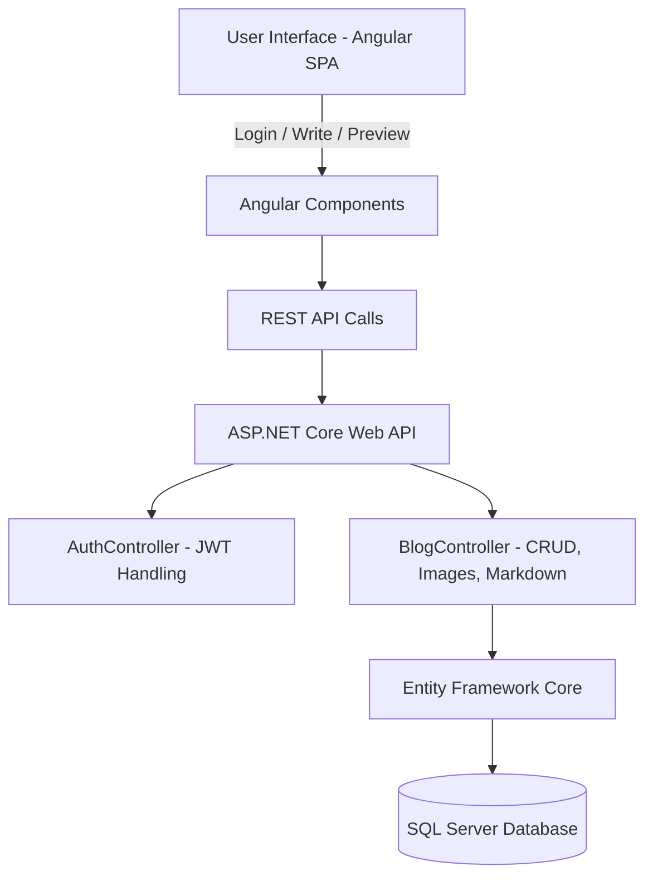

# 📝 CodePulse

A **modern, full‑stack blog platform** with live markdown previews, authentication, role‑based access, and flexible CRUD functionality.


---

## 📌 Table of Contents

- [🧭 Overview](#-overview)
- [✨ Features](#-features)
- [📂 File Structure](#-file-structure)
- [📐 Architecture & Workflow](#-architecture--workflow)
- [⚙️ Setup & Running](#-setup--running)
- [🔧 Tech Stack](#-tech-stack)
- [🤝 Contributing](#-contributing)
- [📄 License](#-license)

---

## 🧭 Overview

**CodePulse** is a full‑stack blog application built with **Angular SPA** for the frontend and **ASP.NET Core Web API** for the backend. It supports user authentication, live markdown editing, image uploads, and full CRUD operations on blog posts.

---

## ✨ Features

- 👤 User registration, login, and role‑based JWT auth  
- 📝 Create/edit/delete blog posts (draft & published)  
- 🔄 Live Markdown preview (Angular)  
- 📸 Image uploads via backend  
- 🔐 Role‑based access control  
- 📄 Swagger UI for API testing in backend

---

## 📂 File Structure

```
root/
├── UI/codepulse/           # Angular frontend
│   ├── src/
│   └── README.md
│
├── codePulse.API/          # ASP.NET Core backend
│   ├── Controllers/
│   ├── Models/
│   ├── Services/
│   ├── Scripts/            # DB seed and migration SQL
│   ├── codePulse.API.sln
│   └── README.md
│
└── README.md               # This document
```

---

## 📐 Architecture & Workflow



---

## ⚙️ Setup & Running

### 🔧 Prerequisites

- [Node.js + Angular CLI]  
- [.NET 6/7/8 SDK]  
- [SQL Server + Management Studio]  

### 🏗 Install & Run

**1. Clone the repo**
```bash
git clone https://github.com/Adnan25z/CodePulse.git
cd CodePulse
```

**2. Setup Frontend**
```bash
cd UI/codepulse
npm install
ng serve --open
```
→ **http://localhost:4200**

**3. Setup Backend**
```bash
cd ../../codePulse.API
dotnet restore
# Apply migrations + seed
dotnet ef database update --context AuthDbContext
dotnet ef database update --context ApplicationDbContext
# (Or run Scripts/seeding+blogs.sql in SQL Server)
dotnet run
```
→ Swagger UI available at `http://localhost:[port]/swagger`

### 👥 Default Admin Credentials

```text
Email: admin@codepulse.com
Password: Password1!
```

---

## 🔧 Tech Stack

| Component        | Technology                              |
|------------------|------------------------------------------|
| Frontend         | Angular SPA, Bootstrap, Ngx-markdown    |
| Backend          | ASP.NET Core Web API, Entity Framework  |
| Auth             | JWT token authentication                |
| DB               | SQL Server                              |
| API Docs         | Swagger                                 |
| DB Tools         | EF Core (Migrations + Seeding)          |

---

## 🤝 Contributing

1. ⭐ Star the repo  
2. 🍴 Fork it  
3. 🛠 Create a feature branch: `feature/awesome-feature`  
4. ✨ Commit changes  
5. 🔀 Push & open a PR  

---

## 📄 License

Licensed under **MIT**. See [LICENSE](./codePulse.API/LICENSE) for details.

---

## 🙌 Thanks


